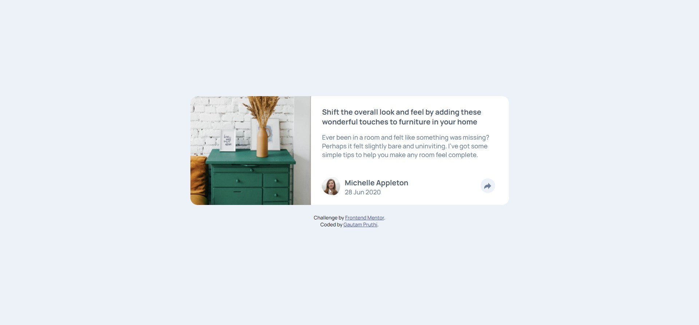

# Frontend Mentor - Article preview component solution

This is a solution to the [Article preview component challenge on Frontend Mentor](https://www.frontendmentor.io/challenges/article-preview-component-dYBN_pYFT).

## Table of contents

- [Overview](#overview)
  - [The challenge](#the-challenge)
  - [Screenshot](#screenshot)
  - [Links](#links)
- [My process](#my-process)
  - [Built with](#built-with)
  - [What I learned](#what-i-learned)
  - [Continued development](#continued-development)
  - [Useful resources](#useful-resources)
- [Author](#author)

## Overview

### The challenge

Users should be able to:

- View the optimal layout for the component depending on their device's screen size
- See the social media share links when they click the share icon

### Screenshot

  - DESKTOP VIEW
  

### Links

- Solution URL: [Add solution URL here](https://your-solution-url.com)
- Live Site URL: [Add live site URL here](https://your-live-site-url.com)

## My process

### Built with

- Semantic HTML5 markup
- CSS custom properties
- Flexbox
- CSS Grid
- Mobile-first workflow
- JavaScript

### What I learned

<!-- Use this section to recap over some of your major learnings while working through this project. Writing these out and providing code samples of areas you want to highlight is a great way to reinforce your own knowledge. -->

This project helped me practice grid and flexbox layout module to position the elements based on different screen size and I also learned to draw a shape, specifically a triangle using CSS.

Code snippets to draw a triangle:

```html
<div class = "arrow-bottom"></div>
```

```css
  .arrow-bottom{
    height: 0;
    width: 0;
    border: 10px solid transparent;
    border-top: 20px solid hsl(217, 19%, 35%);
    position: absolute;
    bottom: -50%;
    left: 36%;
  }
```

### Continued development

<!-- Use this section to outline areas that you want to continue focusing on in future projects. These could be concepts you're still not completely comfortable with or techniques you found useful that you want to refine and perfect. -->

I would like to keep working on using CSS Grid and Flexbox to position elements.

### Useful resources

- [CSS Tricks](https://css-tricks.com/snippets/css/css-triangle/) - This helped me understand on how to draw a triangle using CSS with a visual explanation.
- [w3schools](https://www.w3schools.com/) - This is an amazing site that helped me clarify any confusion which I encountered while making this web-page.

## Author

- Frontend Mentor - [@Gautam1201](https://www.frontendmentor.io/profile/Gautam1201)
